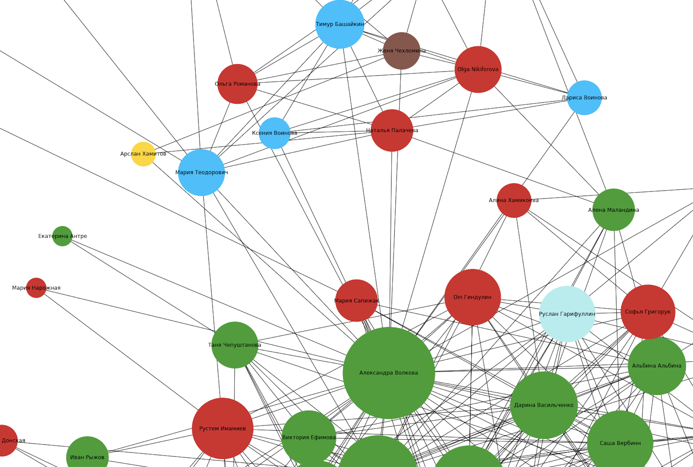

### Analysis and visualisation of social network graph

The aim of the project is to provide descriptive analysis of a social network. In this project I present ego network, its nodes are my friends except me, edges are friendship. The data is collected by VK API. The graph is indirected, homogeneous and unweighted.
##### Description of the network contains:

- Number of nodes and edges.
- Diameter, radius.
- Clustering coefficient.
- Average path length.
- Degree distribution.

##### Structural analysis of the network contains:

- Degree/Closeness/Betweenness/Katz/Eigenvector centralities, top nodes description.

##### Community Detection block contains:

- Clique search, k-cores visualization.
- Comparison of various community detection algorithms.

##### Example of interacting with API. Here I download a list of ids of my friends:

``` python
url = 'https://api.vk.com/method/friends.get?v=5.131&access_token=###'
page = requests.get(url)
html = page.text
my_dict = json.loads(html)
list_of_nodes = my_dict['response']['items']
```

##### Here is an example of how the resulted graph looks like:



The color of the node represents university, the size of the node depends on the number of mutual friends.
